# Mount Allison Artificial Intelligence Society Readings
## Winter 2019, Week 2.

### Theme: Introduction to Machine Learning.
#### Note: The readings will be accompanied be a lecture delivered by Dr. Michael Cormier this week. The lecture will build on the readings, so they are highly encouraged to be read ahead of time.

## Core:
[More than machines](https://www.nature.com/articles/s42256-018-0014-z)

[Machine learning: Trends, perspectives, and prospects](https://www.cs.cmu.edu/~tom/pubs/Science-ML-2015.pdf)

## Recommended:
[But what *is* a Neural Network? | Deep learning, chapter 1 (video)](https://www.youtube.com/watch?v=aircAruvnKk)

## Lecture Slides:
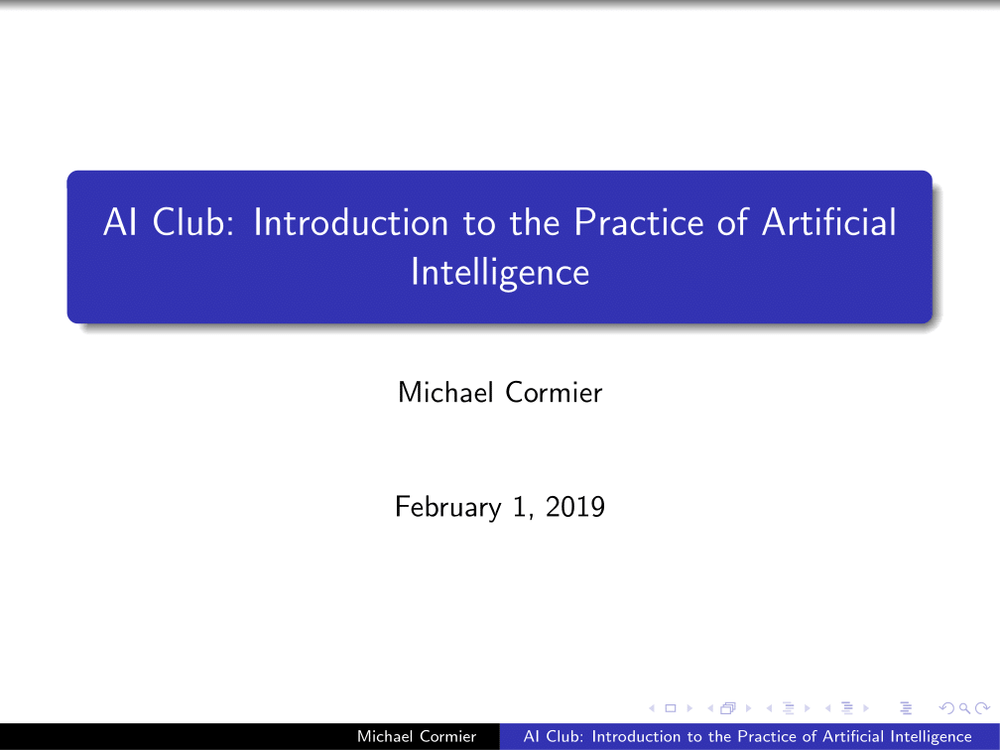
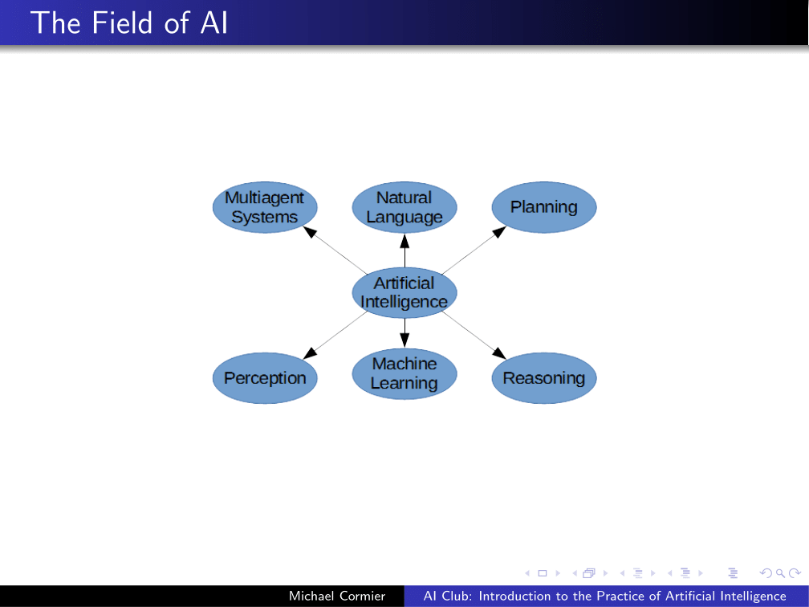
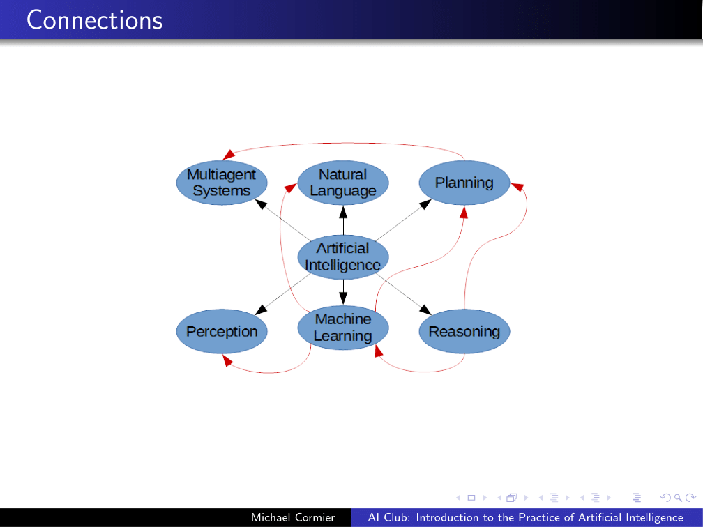
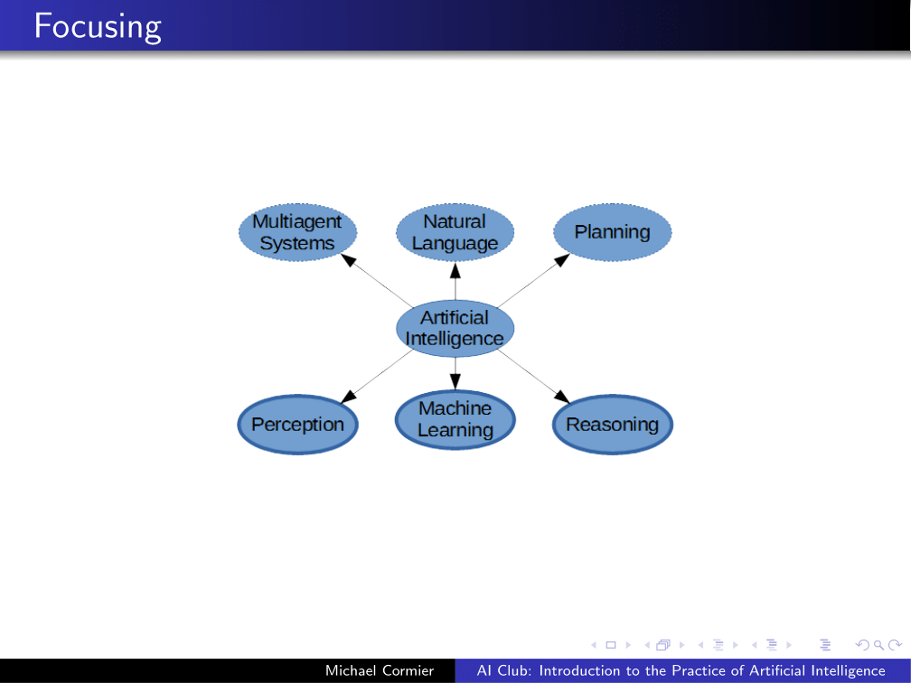
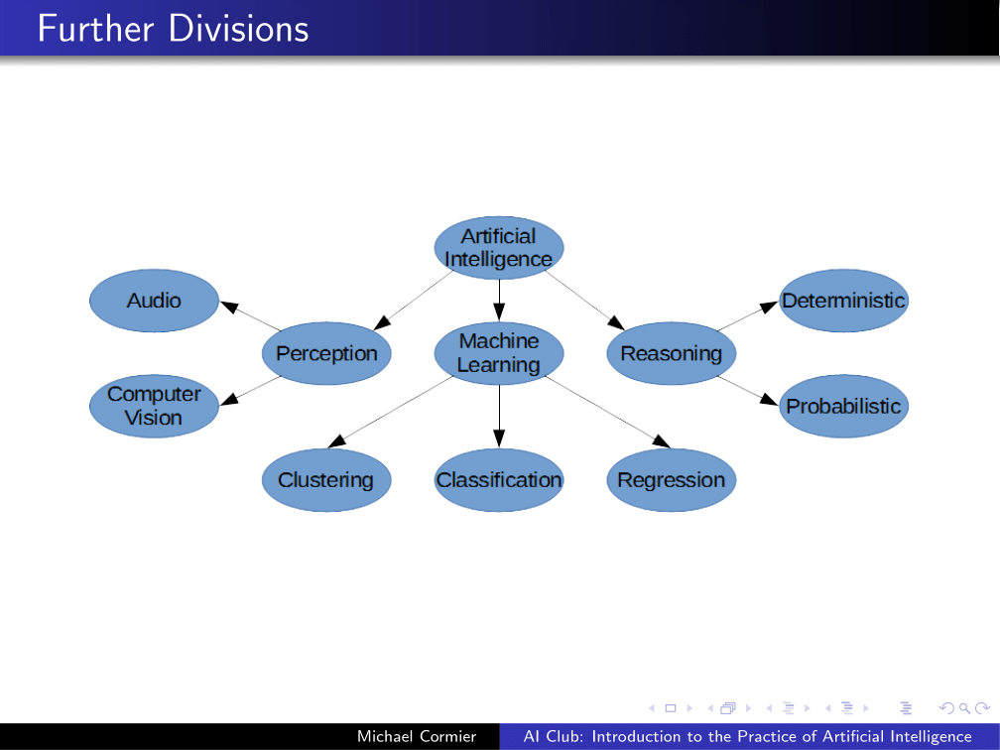
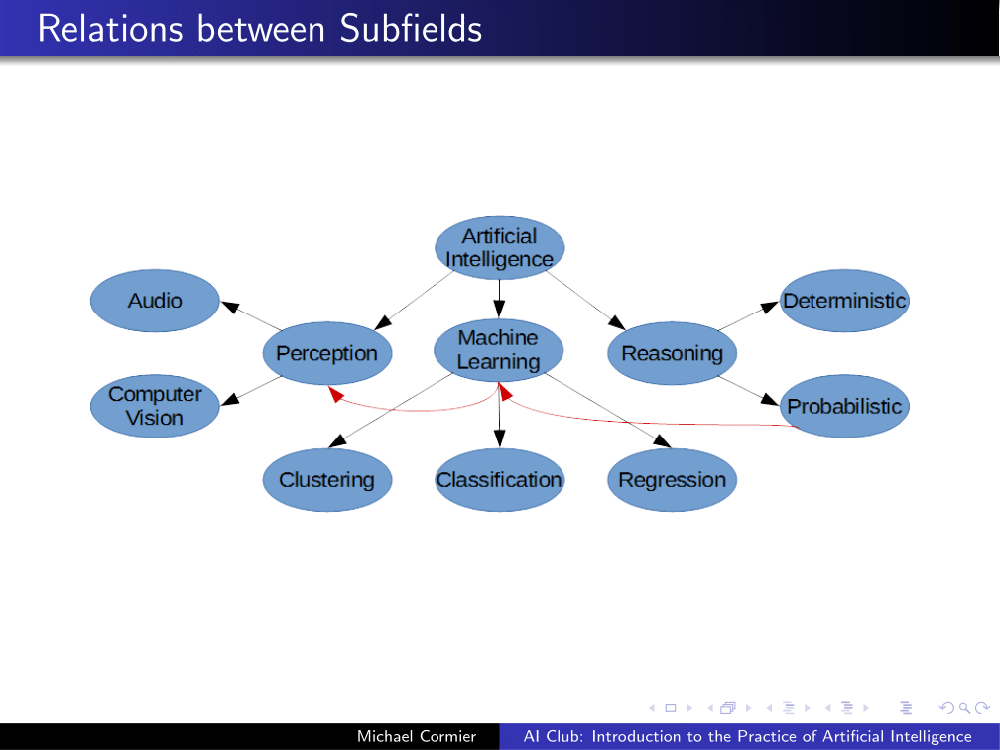
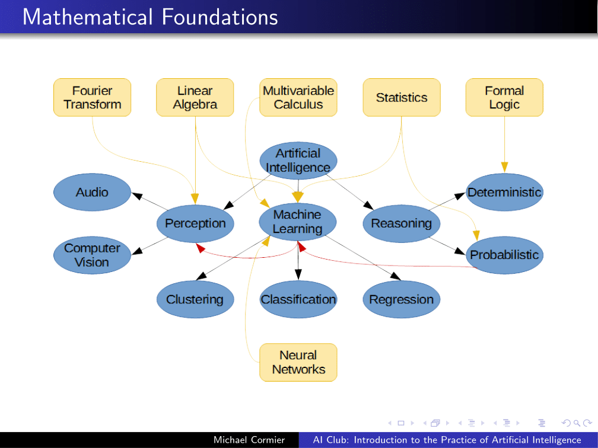
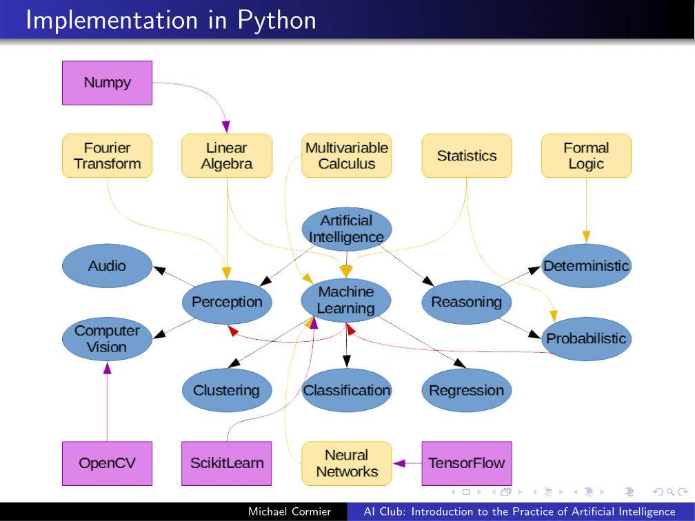
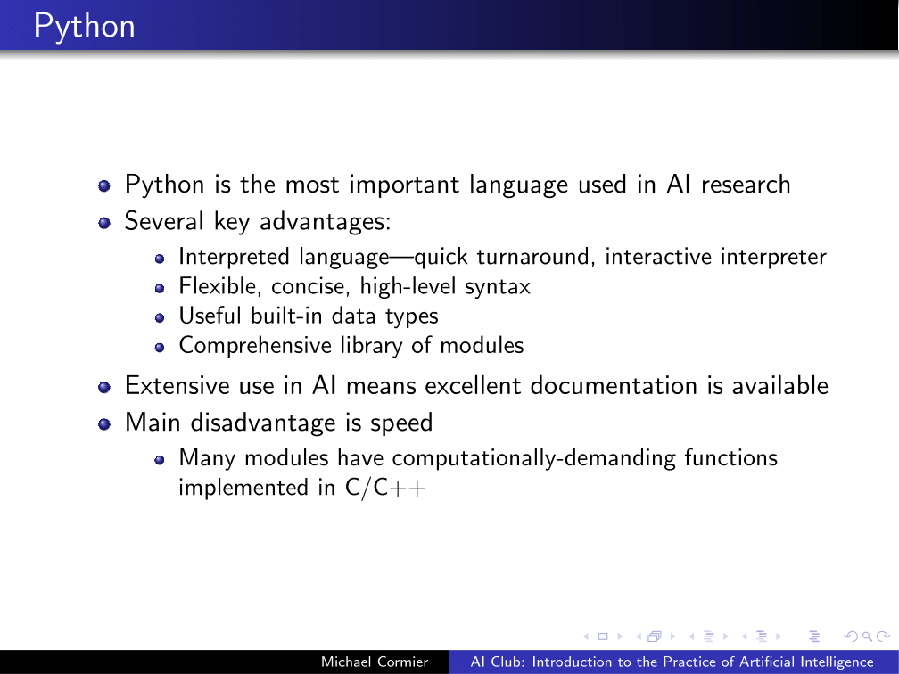
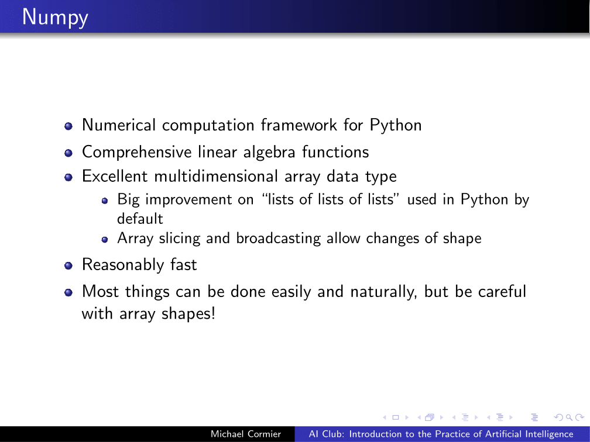
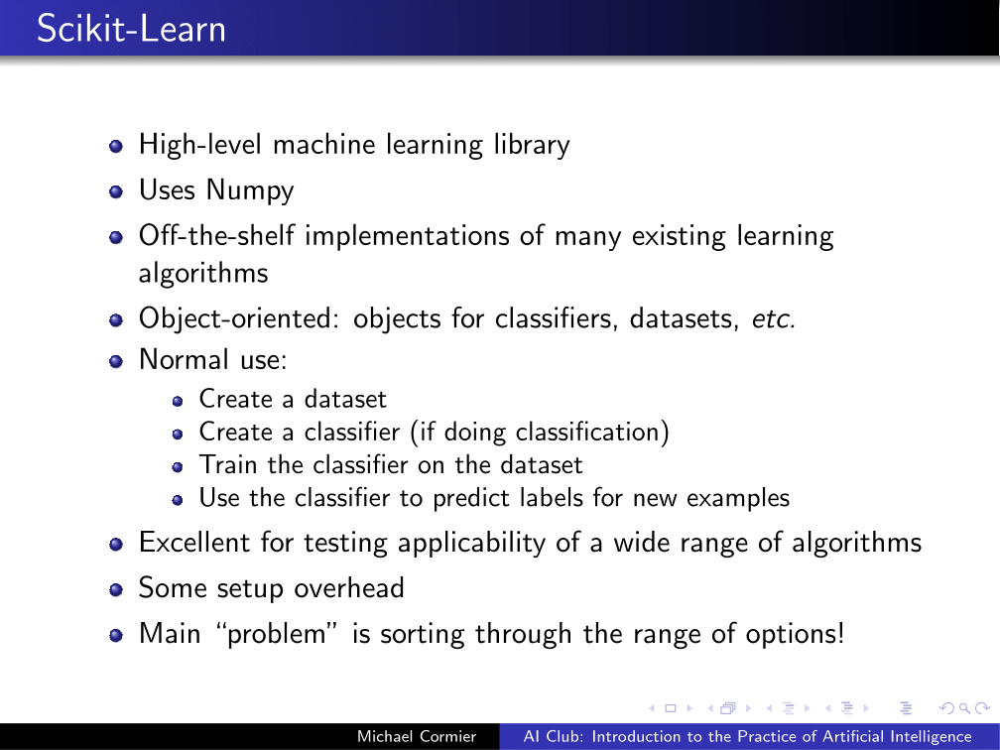
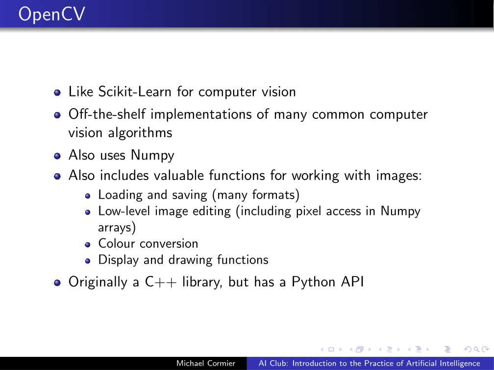
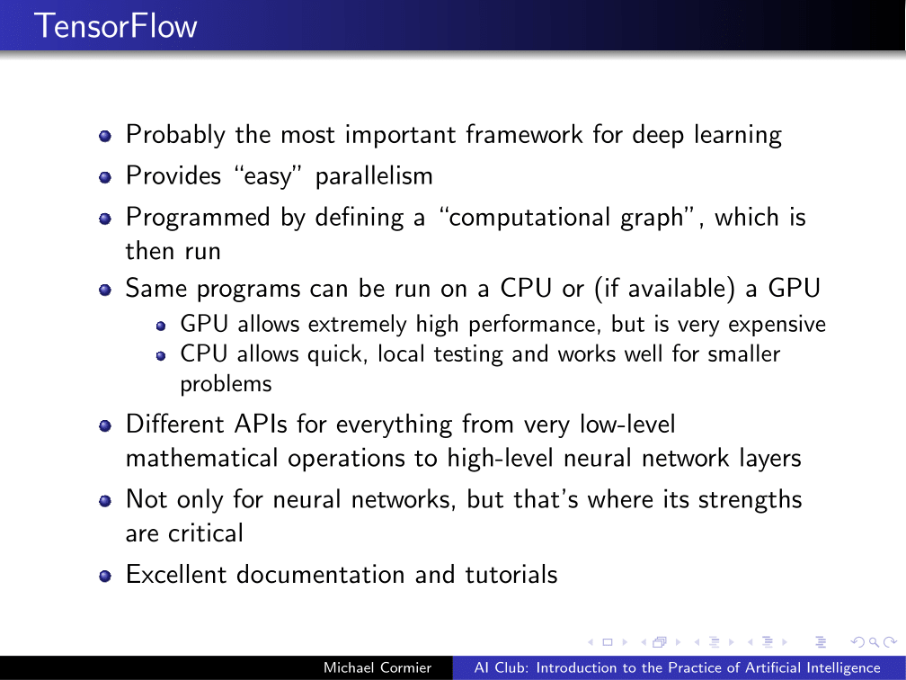
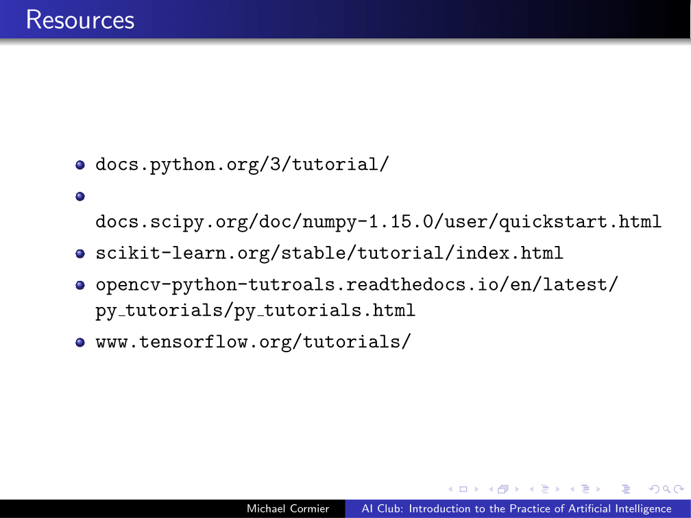
